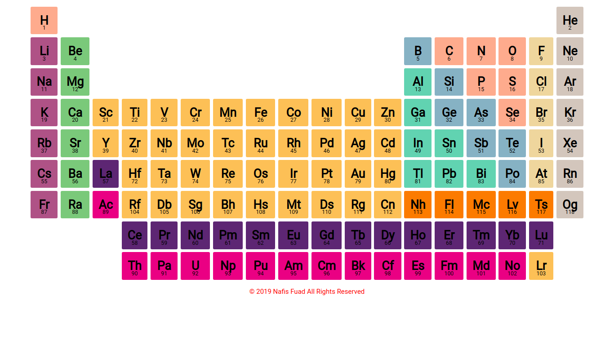
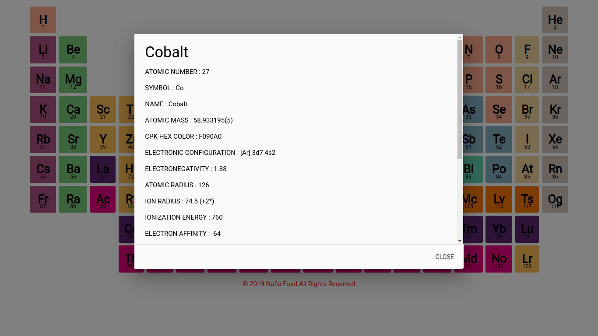

# PERIODIC TABLE

A simple periodic table web app. Built to practice Typescript, webpack, babel,etc. Now the devdependencies have changed so drastically, that things might not work as expected. [view live site here](https://chemicool.herokuapp.com)

### Tech Stack

1. Node.js
2. Typescript
3. Express.js
4. Pug
5. PostCSS
6. Jest (few tests)
7. Webpack + Babel
8. Materialize CSS library

### Features

1. A simple minimal periodic table
2. Displays information about each element when clicked
3. Shows the element name as tootip when hovered over the symbols

### Development

If you want to take a look the code, or just want to developo further on your own, or want to do a PR, follow these steps to download and get started with this project.

1. Open up the terminal.
2. Clone the repo with: `git clone https://github.com/nfuad/periodictable.git`
3. Enter into the periodictable directory: `cd periodictable`
4. Start the development server with: `yarn watch`
   The application should start running on `http://localhost:3000`
   Happy Coding :smile:

### LICENSE

[MIT](./LICENSE)
